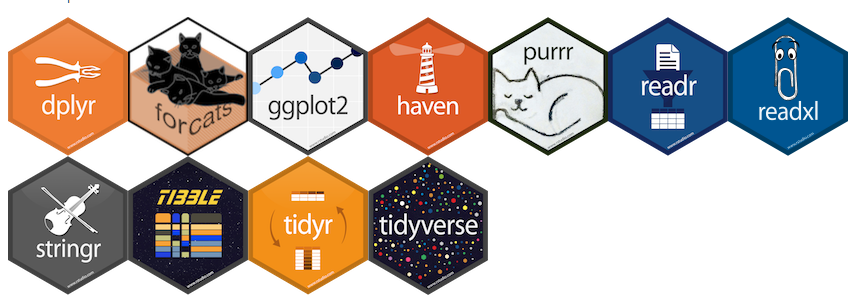

```{r global_options, echo = FALSE, include = FALSE}
options(width = 999)
```

# Motivation for this workshop

## By way of introduction

- I am a doctoral student in Urban Education,
- began using R for data analysis in 2009,
- frustrated with R, began using Pandas and iPython instead,
- in 2016, fell in love with R again.

## Brought to you by the letter 'R'


<div class="notes">
- The names of the creators were Ross and Robert, though their names was not only why it was called the R language. It was in fact an extension of the S programming language. Ross and Robert were both from New Zealand but R is not only for Kiwis! The benefits of R are transcultural.
- How many have already some experience with R? If not, what other software have you used to analyze data?
- I am assuming you at have done data analysis before though  not necessarily with R. Nor necessarily with prior programming experience.
</div>

## Data analysis, the right way and wrong way

<div class="columns-2">


</div>

<div class="notes">
- How many of you analyze data? How much data is there? Do you often have to prepare that data before you can analyze it?
- I think, perhaps foolishly, there is a *right* way of doing data analysis with R. Save yourself lost sleep and don't try to learn it as a programming language.
</div>

## But, what is "data analysis"?

"Procedures for **analyzing** data, techniques for **interpreting** the results of such procedures, ways of planning the **gathering** of data to make its analysis easier, more precise or more accurate, and all the machinery and results of (mathematical) **statistics** which apply to analyzing data." (John W. Tukey, 1961) 

<div class="notes">
- The key related phrases being: "analyzing" is the "interpreting" of "statistics" after "gathering" data
</div>

## A schematic view of data analysis process {.flexbox .vcenter}


 
<div class="notes">
- This workshop covers **all but the Model stage** but we will definitely **explore data**.
</div>

## Why you use R for data analysis | Or should, if you are not already

* It is **open source and free** unlike Stata, SAS, SPSS, etc.
* Good **documentation** and large online community (e.g., [Stack Overflow](https://stackoverflow.com/questions/tagged/r))
* Many available packages from [Comprehensive R Archive Network](https://cran.r-project.org/) and GitHub

<div class="notes">
- Beautiful graphics with the `ggplot2` package and
</div>

## How not to teach R

Garrett Grolemund of RStudio has [shared](https://rviews.rstudio.com/2017/02/22/how-to-teach-r-common-mistakes/) a few principles we will follow:

1. Do not teach R as if it were a programming language 
2. Do not avoid the lecture 
3. Do not let your workshop become a consulting clinic for installation bugs 

<div class="notes">
- Implication of #1: empower students to use R for the task at hand, in this case data analysis
- Implication of #2: convey large amounts of information in a short period of time
- Implication of #3: provide hosted RStudio for students who have not installed R
</div>

# Basics for data analysis

## Welcome to the tidyverse

```{r echo=TRUE,message=FALSE,results='hide',warning=FALSE}
library(tidyverse)
```



<div class="notes">
- These projects together share a common philosophy that marks an important shift away from the old, and arguably more frustrating, way of doing data analysis in R
</div>

## Tidy your data


<div class="notes">
- r4ds suggests three interrelated rules which make a dataset tidy:
- Each variable must have its own column.
- Each observation must have its own row.
- Each value must have its own cell.
</div>

## Importing data

Use `readr` and `readxl` packages

```{r eval=FALSE}
readr::read_csv('path/to/file.csv')
readr::read_csv('http://host/file.csv')
readxl::read_csv('path/to/file.xlsx')
```

<div class="notes">
- We use the `readr::read_csv()` for CSV files and `readxl::read_excel()` for Excel files. The name of the package is before the `::` and the name after is the function. We assume we have installed these packages, which are included in `tidyverse`.
- Notice `read_csv` can take a url whereas we need to download the excel file first.
</div>

## Load up sample data

```{r}
library(nycflights13)
flights %>% head(5)
```

<div class="notes">
- We are going to load sample flight data and inspect the first five rows
- When I learned about the `%>%` piping operator, it changed my life forever.
</div>

## Pipe it like it's hot  {.columns-2}

- **pipes** are expressed with the `%>%` operator
- pipes can be **combined** (chained)
- pipes treat data frames as **immutable**


<div class="notes">
- The piping operator is introduced by the `magittr` package
- The data frame is immutable in this approach. The left-hand side of the operator is not changed by the right hand side. 
</div>

## Selecting and transforming data

```{r}
flights %>%
  mutate(date = as.Date(sprintf('%d-%.2d-%.2d', year, month, day)),
         weekday = weekdays(date)) %>%
  select(date, weekday, air_time, distance) %>%
  head(5)
```

<div class="notes">
- `mutate()` creates new variables. Here we combine the date variables, cast it as a date object, and then use the `weekdays` to get the day of the week.
- `select()` selects variables. We use this to focus on just the variables we are interested in.
- `separate()` turns a single chr variable into multiple (opposite `unite` can replace `mutate`)
- Importantly, we never alter state of our program. The `flights` data frame is the same after we apply these piped statements.
</div>


## Filtering and ordering data

```{r}
flights %>%
  filter(day < 8) %>%
  arrange(-air_time,distance) %>%
  select(day, carrier, flight, air_time, distance) %>%
  head(5)
```

<div class="notes">
- `filter()` reduces the number of observations using a matching condition
- `arrange()` order data by the value of particular variables
- `day` variable is of time `<int>` so we can be sure this matching condition
- The use of the negative sign (`-`) in the `arrange` function before a variable specifies that we want to order the data in descending order for that variable. Here we have combined both ascending and descending ordering.
</div>

## Tidying your data

- The "tidy" principle is one observation per row and one variable per column
- But data is often not organized the way your analysis requires

## Tidying example: What we got 

```{r}
table4a
```

<div class="notes">
- This is a sample table added the `tidyverse` package
- As is typical, the data is not in a shape that makes generating statistics easy. But all hope is not lost.
</div>

## Tidying example: what we wanted


```{r}
table4a %>%
  gather(-country, key = "year", value = "cases")
```

<div class="notes">
- `gather` is provided by the `tidyr` package to transform a "wide" table into a "long" table
- `-country` selects all columns but `country`
- The `key` and `value` parameters help us name the variables we are creating from what had previously been column names
- `spread` is the opposite of `gather` so can be used when the data you have is currently in a "long" rather than a "wide" format
</div>

## Let's get statistical

```{r}
flights %>%
  summarise(maxairtime = max(air_time, na.rm=TRUE))
```

```{r}
flights %>% 
  summarise(avg_time = mean(air_time, na.rm=TRUE),
            avg_speed = mean(distance/air_time, na.rm=TRUE))
```

<div class="notes">
- remember you always have to deal with how to handle `NA` values
- easy to add multiple summarized variable based on multiple variable
- also can get summary statistics with `flights %>% summary`
</div>

## More than one dataset

```{r}
weather %>%
  filter(origin == 'EWR') %>%
  head(5)
```

<div class="notes">
- The `nycflights13` package also provides weather data which we might want to combine with the flights data
</div>

## Get It Together | Combining weather and flights data

```{r}
flightsweather <- flights %>%
  left_join(weather, by = c("origin", "year", "month", "day", "hour")) %>%
  select(origin, dep_delay, wind_speed)
flightsweather %>% head(5)
```

<div class="notes">
- The `left_join` is one way we can combine two data frames. It will return us all the rows from `flights`, locate the row in `weather` using the column names in the `by` parameter, and add the variables from `weather` to the returned data frame, nulling them when no row was found.
- We save the joined dataset for future work.
</div>

## Explore variables with visualizations 

```{r warning=FALSE,message=FALSE,fig.height=3}
flightsweather %>%
  na.omit() %>%
  ggplot(aes(x=dep_delay)) +
  geom_histogram(aes(y=..density..),
                 binwidth = 5)
```

<div class="notes">
- We can pipe our data frame into `ggplot`, the most magical data visualization library ever.
- It is hard to see but there's a maximum value of 1301 for the `dep_delay` variable.
</div>

## More than just pretty graphics

```{r warning=FALSE,message=FALSE,fig.height=3}
flightsweather %>%
  filter(wind_speed < 250 & dep_delay < 500) %>%
  ggplot(aes(x=wind_speed, y=dep_delay)) +
    geom_point() +
    geom_smooth() +
    facet_grid(. ~ origin)
```

<div class="notes">
- Remove outliers (wind speed below 250 and departure delay of less than 500)
- EWR flights seem more affected by high wind speeds
</div>

# Let's hit the gym

## First, stretch {.columns-2}

Take a five minute break.


<div class="notes">
- Write up IP address, login, password
- Make sure assistants are ready to help students
- Image credit: George Arents Collection, The New York Public Library. "Exercise 9. Stretching exercise." The New York Public Library Digital Collections. http://digitalcollections.nypl.org/items/510d47e2-3058-a3d9-e040-e00a18064a99
</div>

## Proper gym equipment | R and RStudio Desktop

* Install [R](https://r-project.org/) and [RStudio Desktop](https://www.rstudio.com/products/rstudio/download/)
* Read the RStudio Desktop [documentation](https://support.rstudio.com/hc/en-us/sections/200107586-Using-the-RStudio-IDE)

<div class="notes">
- Project myself logging in
- Connect to gcdf WiFi network with password provided
- If you are using a loaned laptop, open your web browser to web address provided
</div>

## Start with free weights | Use the R Console

Familiarize yourself with the [Console](https://support.rstudio.com/hc/en-us/articles/200404846-Working-in-the-Console) 

```{r eval=FALSE}
version
sessionInfo()
x <- date()
x
```

<div class="notes">
- `version` and `sessionInfo()` tell us a bit about the R environment we are working in
- we can create new objects and print them out
</div>

## Remember gym etiquette | Create an R project {.columns-2}

* Don't make a mess! Use [Projects](https://support.rstudio.com/hc/en-us/articles/200526207-Using-Projects)
* *File > New Directory > New Project*


## Tracking your progress | Keep an R Notebook

* A notebook is an **rmarkdown** document intended for recording your analyses
* Rather than comment your code, your documentation contains code
* Chunks are executed **independently** and **interactively**


<div class="notes">
- Create a notebook with "File > New File > R Notebook"
</div>

## What’s your max, bro? | Keeping research reproducible

* Notebooks are an example of **literate programming**
* Notebooks are **reproducible** documents
* Rmarkdown generates publication-quality output  
* Share project as a git repository: [do-the-right-thing](https://github.com/GCDigitalFellows/do-the-r-thing)

<div class="notes">
- Your notebook can actually explain your research to others!
- This presentation is actually written in R Markdown, so the output of a block of code can be included in the resulting document.
</div>
